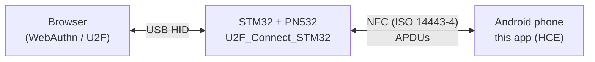

# U2F_Android

Android app that turns a phone into the authenticator of a **FIDO U2F security key**.

The phone doesn't connect to the PC directly. It is paired with an STM32 board ([U2F_Connect_STM32](https://github.com/OlderHermit/U2F_Connect_STM32)) that presents itself to the browser as a USB U2F key and forwards every request over NFC. This app receives those requests through Android **Host Card Emulation (HCE)**, generates and stores the keys on the phone, and signs the challenges. The board is just a bridge; the phone holds the keys and does the cryptography.

Written in Kotlin from scratch as part of my engineering thesis, together with the STM32 firmware.

> This work was created as part of the educational process at the Polish-Japanese Academy of Information Technology (PJATK).
> *Utwór powstał w wyniku realizowania procesu edukacyjnego w PJATK.*

## How it fits together



The STM32 side and the transport layer are described in detail in the [U2F_Connect_STM32 README](https://github.com/OlderHermit/U2F_Connect_STM32#how-it-works). This README covers what happens on the phone.

## Features

- **U2F Register** – generates a new P-256 key pair per site, returns the public key, key handle, attestation certificate and signature.
- **U2F Authenticate** – signs the challenge with the key registered for that site, with a signature counter; also supports the *check-only* mode (`0x07`) used by browsers to find out whether a key is registered.
- **U2F Version** – returns `U2F_V2`.
- **Echo** – answers the U2FHID `PING` forwarded by the board.
- **Multi-part transfers** – reassembles requests that arrive in several NFC exchanges and splits long responses into parts, so U2F messages larger than one NFC frame work.
- **Unlock gate** – requests are processed only after the user has authenticated in the app with biometrics or the device PIN/pattern.

## How it works on the phone

### HCE service

`U2FHostApduService` is registered for the AID `F0 05 04 03 02 01 A1` (`res/xml/apduservice.xml`). Every request from the board is a `SELECT AID` APDU with the U2F payload appended after the AID:

| Bytes | Field |
| --- | --- |
| `00 A4 04 00` | SELECT header |
| `07` | AID length |
| `F0 05 04 03 02 01 A1` | AID |
| 4 bytes | U2FHID channel ID (identifies the transaction) |
| 1 byte | number of packets remaining in this request |
| n bytes | U2F request in raw message format – its `INS` byte selects the operation |
| `00` | Le |

| `INS` | Operation |
| --- | --- |
| `0x01` | Register |
| `0x02` | Authenticate |
| `0x03` | Version |
| `0x04` | Continue – custom: the board asks for the next part of a long response |
| `0x05` | Echo – custom: carries the U2FHID `PING` payload |

Responses end with `90 00` on success (`6F 00` on failure). The first response to a request starts with the number of parts; long responses are split into parts of up to 160 bytes, which the board fetches one by one with `Continue`.

The service is declared with `requireDeviceUnlock="false"` so that Android can start it when the phone is tapped on the reader. The service itself still refuses to do any work until the user has unlocked the app (see below).

### Transaction state

Partially received requests and prepared responses are kept in a **Proto DataStore** (`CommunicationData.proto`), keyed by the channel ID. This lets a transfer survive the phone being moved away from the reader and tapped again. Cached data expires after 5 minutes, and a new request on a different channel replaces it.

### Keys and storage

- **Key pair:** EC P-256, generated per registration.
- **Private key:** stored in the **Android Keystore**, under an alias derived from the key handle.
- **Key handle:** the private key and application ID encrypted with AES-256-GCM using a master key that never leaves the Android Keystore. The handle is returned to the browser and used to find the right key at login.
- **Registered sites:** pairs of key handle and application ID in a second Proto DataStore (`SavedKeys.proto`). On authentication the app checks that the handle exists and belongs to the requesting site.
- **Attestation certificate:** a self-signed X.509 certificate generated with Bouncy Castle for each key.
- **Signature counter:** a single global counter kept in `SharedPreferences`.

### Unlock gate

`MainActivity` shows a `BiometricPrompt` (strong biometrics or device credential) when it starts. Only after a successful authentication does the status switch to *U2F vault unlocked* and the service starts processing requests. As soon as the activity goes to the background, the vault is locked again.

## Requirements

- Android phone with **NFC and HCE support**, Android 11 or newer (min SDK 28, but the main screen requires API 30).
- A screen lock or biometrics set up on the phone.
- The [U2F_Connect_STM32](https://github.com/OlderHermit/U2F_Connect_STM32) board connected to the PC.

Tested on a Samsung Galaxy S21 FE.

## Building

The project uses Gradle (wrapper included) and was developed in **Android Studio**.

```sh
./gradlew assembleDebug
```

or open the project in Android Studio and run the `app` configuration on a connected phone. Protobuf classes for the DataStore are generated automatically by the protobuf Gradle plugin.

Main dependencies: AndroidX DataStore with protobuf-javalite, AndroidX Biometric, Bouncy Castle (`bcpkix`).

## Usage

1. Enable NFC on the phone.
2. Open the app and authenticate with your fingerprint or PIN. The status changes to *U2F vault unlocked*.
3. Keep the app open and start registering a security key (or logging in) on a website.
4. When the browser asks for your security key, hold the phone on the PN532 antenna until the operation finishes.

## Project structure

```
app/src/main/
├── java/pl/pja/hce_test/
│   ├── U2FHostApduService.kt          # HCE service: APDU validation, U2F operations, multi-part handling
│   ├── HostApduServiceUtil.kt         # Key pair, key handle, certificate generation, signing
│   ├── CommunicationStruct.kt         # In-memory model of a transaction, splitting/joining packets
│   ├── CommunicationDataSerializer.kt # DataStore serializers
│   ├── SavedKeysSerializer.kt
│   └── MainActivity.kt                # Biometric unlock screen
├── proto/                             # DataStore schemas (transaction cache, registered keys)
├── res/xml/apduservice.xml            # HCE AID registration
└── AndroidManifest.xml
```

## Status and limitations

This is a proof of concept built for a thesis, not a production authenticator. The full register-and-login flow was demonstrated end to end at the thesis defense.

### Design decisions

- **The app must be open and unlocked to use the key.** This is deliberate. A classic U2F key only asks for a button press, so anyone holding the key can use it. Here the biometric / device-credential prompt acts as both user presence and user verification: a lost or locked phone tapped on the reader won't sign anything. Locking the vault as soon as the app goes to the background keeps that window short.
- **Self-signed attestation.** Each key gets its own self-signed certificate instead of a vendor attestation certificate. Most websites request `none` attestation and never see it, but sites that require `direct` attestation from a known vendor will reject the key.
- **Custom transport instead of standard NFC U2F.** The phone talks only to the STM32 bridge, over a custom protocol on top of HCE that supports multi-part messages. It is not a standalone NFC security key yet (see [Future work](#future-work)).

### Limitations

- **FIDO U2F (CTAP1) only** – no FIDO2 / CTAP2, so no passwordless login or resident keys.
- The app is still named `HCE_Test` (package `pl.pja.hce_test`) from the early prototype.

### Post-thesis fixes (not yet verified on hardware)

These bugs were found while reviewing the code after the thesis and have been fixed, but the fixes haven't been tested with the STM32 bridge yet.

- **Authentication responses were not signed.** A condition in the `Authenticate` handler was inverted, so the signature data was returned without being signed. Login failed on websites that verify the signature, which is most of them.
- **Registration signature used the wrong layout.** The challenge and application parameters were offset by one byte and signed in the wrong order. This only mattered on sites that request `direct` attestation.
- **The *Clear Cache* button did nothing.** It read the clean-up flag instead of setting it.

## Future work

**Standard FIDO NFC support.** The plan was for the app to detect whether it is talking to the STM32 bridge or to a client that supports FIDO over NFC natively (for example a phone or laptop with an NFC reader), and switch protocols accordingly. With the standard protocol (AID `A0 00 00 06 47 2F 00 01`) the phone could work as a regular NFC security key, without the bridge. There wasn't enough time to implement it within the thesis.

While designing the custom transport I ended up close to the standard on my own: both select the applet with a `SELECT AID` APDU, split long requests into chained parts, and fetch long responses in pieces (`Continue` here, `GET RESPONSE` in the standard). That should make adding standard support mostly a matter of mapping one onto the other.

## License

Licensed under the [Apache License 2.0](LICENSE). The work was created as part of the educational process at PJATK, which holds a non-exclusive license to it.

## Author

Zdzisław Małachowski
